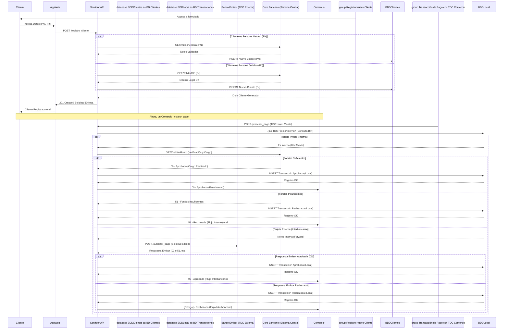

```mermaid
sequenceDiagram
    participant Cliente
    participant AppWeb
    participant BackEnd as Servidor API
    participant database BDDClientes as BD Clientes
    participant database BDDLocal as BD Transacciones
    participant BancoEmi as Banco Emisor (TDC Externa)
    participant CoreBancario as Core Bancario (Sistema Central)
    participant Comercio
    
    %% --- Sección de Registro de Clientes ---
    
    group Registro Nuevo Cliente->>Cliente: Accesa a formulario
        Cliente->>AppWeb: Ingresa Datos (PN / PJ)
        AppWeb->>BackEnd: POST /registro_cliente
        
        alt Cliente es Persona Natural (PN)
            
            BackEnd->>CoreBancario: GET/ValidarCedula (PN)
            CoreBancario-->>BackEnd: Datos Validados
            BackEnd->>BDDClientes: INSERT Nuevo Cliente (PN)
            
        else Cliente es Persona Jurídica (PJ)
            
            BackEnd->>CoreBancario: GET/ValidarRIF (PJ)
            CoreBancario-->>BackEnd: Estatus Legal OK
            BackEnd->>BDDClientes: INSERT Nuevo Cliente (PJ)
            
        end
        
        BDDClientes-->>BackEnd: ID de Cliente Generado
        BackEnd->>AppWeb: 201 Creado | Solicitud Exitosa
        AppWeb-->>Cliente: Cliente Registrado end

    %% --- Separador entre Flujos ---
    
    Note over Cliente, Comercio: Ahora, un Comercio inicia un pago.
    
    %% --- Sección de Transacción con Tarjeta de Crédito (TDC) ---
    
    group Transacción de Pago con TDC Comercio->>BackEnd: POST /procesar_pago (TDC: xxxx, Monto)
        
        BackEnd->>BDDLocal: ¿Es TDC Propia/Interna? (Consulta BIN)
        
        alt Tarjeta Propia (Interna)
            
            BDDLocal-->>BackEnd: Es Interna (BIN Match)
            BackEnd->>CoreBancario: GET/DebitarMonto (Verificación y Cargo)
            
            alt Fondos Suficientes
                CoreBancario-->>BackEnd: 00 - Aprobada (Cargo Realizado)
                BackEnd->>BDDLocal: INSERT Transacción Aprobada (Local)
                BDDLocal-->>BackEnd: Registro OK
                BackEnd->>Comercio: 00 - Aprobada (Flujo Interno)
            
            else Fondos Insuficientes
                CoreBancario-->>BackEnd: 51 - Fondos Insuficientes
                BackEnd->>BDDLocal: INSERT Transacción Rechazada (Local)
                BDDLocal-->>BackEnd: Registro OK
                BackEnd->>Comercio: 51 - Rechazada (Flujo Interno) end
            
        else Tarjeta Externa (Interbancaria)
            
            BDDLocal-->>BackEnd: No es Interna (Forward)
            
            %% Interacción con el Emisor Externo
            BackEnd->>BancoEmi: POST /autorizar_pago (Solicitud a Red)
            BancoEmi-->>BackEnd: Respuesta Emisor (00 o 51, etc.)
            
            alt Respuesta Emisor Aprobada (00)
                BackEnd->>BDDLocal: INSERT Transacción Aprobada (Local)
                BDDLocal-->>BackEnd: Registro OK
                BackEnd->>Comercio: 00 - Aprobada (Flujo Interbancario)
                
            else Respuesta Emisor Rechazada
                BackEnd->>BDDLocal: INSERT Transacción Rechazada (Local)
                BDDLocal-->>BackEnd: Registro OK
                BackEnd->>Comercio: [Código] - Rechazada (Flujo Interbancario)
            end
            
        end
        
    end
```